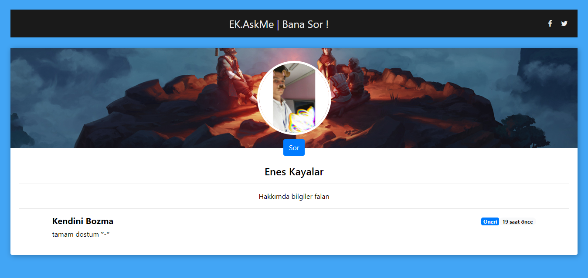
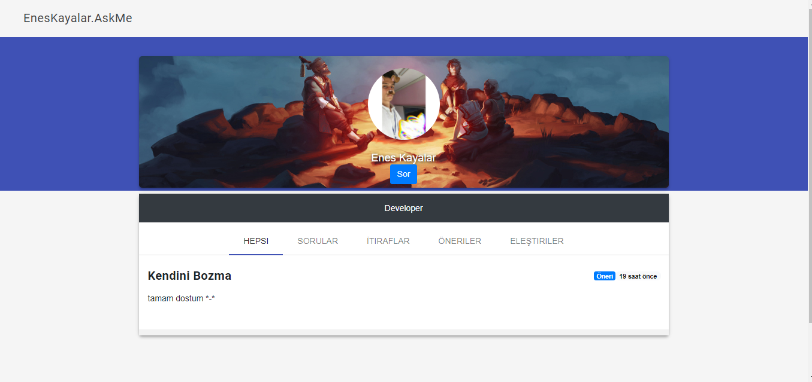

# ask-me-script
It's a simple questioning app I've developed before. It is so easy to use, if you enter your database information from the config.php file and save the sql file to the database, it will work. To change the administrator password, enter your md5 password in the 'site_pass' column on the 'ayarlar' table.

## Screenshots

